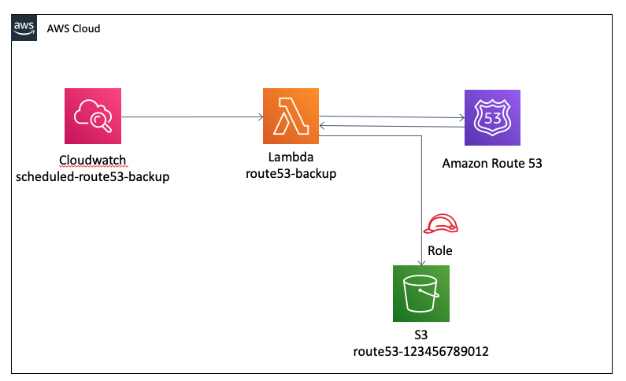
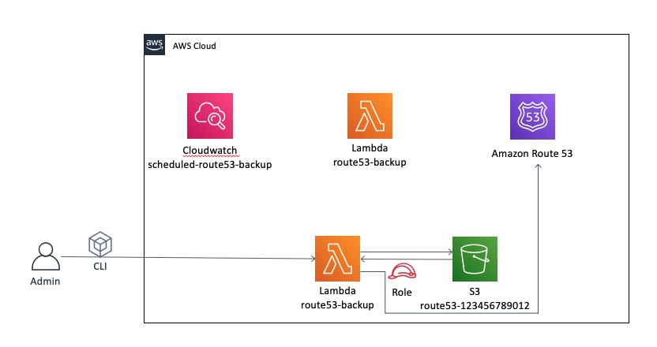

# Setup Route53 Backup 
Amazon Route53 is a managed DNS web service. Route53 is often a mission critical asset in the organization. 
 
The following tool enables:
 1. Create route53 backup bucket 
 2. Backup of Route53 DNS Records
 3. Backup of Route53 Health checks
 4. Restore capability to both of the above

## Architecture
### Backup data flow

### Restore data flow

## Prerequisites:
* Valid access keys at `~/.aws/credentials` with a default profile configured or matching [AWS Environment Variables](https://docs.aws.amazon.com/cli/latest/userguide/cli-configure-envvars.html)  
* `Python` ,`Pipenv` & `npm` installed on the host running the tool

## Deploy backup lambda
 
```bash
git clone https://github.com/bridgecrewio/HowCrew.git
cd HowCrew/backup-route53
npm i 
sls deploy --backup-bucket ${NAME_OF_BUCKET_TO_CREATE} --backup-interval ${INTERVAL_IN_MINUTES}
```
### Deployment parameters:

| Key             | Description                                             | Default value |
|-----------------|---------------------------------------------------------|---------------|
| backup-bucket   | Name of S3 bucket to create and backup dns records into | ${AWS_ACCOUNT_ID}-route53|
| backup-interval | Interval, in minutes, of scheduled backup               | 120 minutes |
| region          | Region of resources to be deployed                        | us-west-2 |


## Manually triggering route53 backup 
using aws CLI - trigger `backup-route53` lambda.
```bash
aws lambda invoke --function-name backup-route53 --log-type Tail --query 'LogResult' --output text |  base64 -d
```
## Restoring data from bucket
using aws CLI - trigger `restore-route53` lambda.
```bash
aws lambda invoke --function-name restore-route53 --log-type Tail --query 'LogResult' --output text |  base64 -d
```

## Backup json structure
TODO

## Route53 backup bucket security configuration
When the lambda creates the S3 bucket it ensures that it has:
* Bucket versioning enabled
* Data encrypted at rest
* Data encrypted at transport
* Bucket is set to private